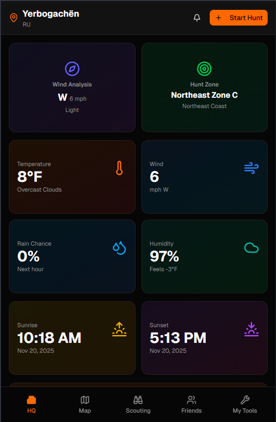

# Camo and Ammo Web Mobile Version 👋
React + Vite frontend and Convex backend

A comprehensive hunting companion web application built with React, Vite, and Convex. Track hunts, manage properties, connect with fellow hunters, and access hunting resources all in one place.



## Features

### Core Functionality
- **User Authentication**: Multiple auth methods including Google OAuth, password-based, and OTP verification
- **Profile Management**: Complete user profiles with hunting preferences, weapon types, and emergency contacts
- **Hunting Map**: Interactive map with property boundaries, hunting units, and location tracking
- **Track Recording**: Record and save hunting tracks with GPS coordinates, elevation, and statistics
- **Waypoints**: Mark important locations (stands, blinds, cameras, etc.) on the map
- **Hunt Logging**: Track hunts with species, method, weather conditions, and harvest details
- **Scouting Trips**: Plan and organize scouting trips with friends
- **Land Lease Marketplace**: Browse and list hunting land leases
- **Forums**: Community forums for sharing tips, stories, and hunting spots
- **Recovery Services**: Request help for deer recovery and vehicle recovery
- **Weather & Solunar Data**: Access current weather conditions and solunar information
- **Friend System**: Connect with other hunters and share locations
- **Location Sharing**: Real-time location sharing with friends

### Admin Features
- Member management and moderation
- Forum moderation with warning and ban system
- Audit trail logging
- Support ticket management
- Role-based permissions

## Tech Stack

### Frontend
- **React 19** - UI framework
- **Vite 7** - Build tool and dev server
- **TypeScript** - Type safety
- **React Router** - Client-side routing
- **Tailwind CSS 4** - Styling
- **Radix UI** - Accessible component primitives
- **React Hook Form** - Form management
- **Zod** - Schema validation
- **TanStack Query** - Data fetching and caching
- **Google Maps API** - Interactive maps
- **Recharts** - Data visualization
- **Motion** - Animations

### Backend
- **Convex** - Real-time backend with automatic reactivity
- **@convex-dev/auth** - Authentication system
- **Resend** - Email service for OTP and notifications
- **OpenWeather API** - Weather data

## Prerequisites

- **Node.js** 18+ and npm/yarn
- **Convex account** - Sign up at [convex.dev](https://convex.dev)
- **Google OAuth credentials** (for Google sign-in)
- **Google Maps API key** (for map features)
- **OpenWeather API key** (for weather features)
- **Resend API key** (for email functionality)

## Getting Started

### 1. Clone the Repository

```bash
git clone <repository-url>
cd camo-web
```

### 2. Install Dependencies

```bash
npm install
# or
yarn install
```

### 3. Set Up Convex

If you haven't already, install the Convex CLI globally:

```bash
npm install -g convex
```

Login to Convex:

```bash
npx convex dev
```

This will:
- Create a new Convex project (if needed)
- Generate deployment credentials
- Start the Convex development server

### 4. Configure Environment Variables

#### Frontend Environment Variables

Create a `.env` file in the root directory:

```env
VITE_GOOGLE_MAPS_API_KEY=your_google_maps_api_key
```

#### Convex Environment Variables

Set these in your Convex dashboard or via CLI:

```bash
npx convex env set GOOGLE_CLIENT_ID=your_google_client_id
npx convex env set GOOGLE_CLIENT_SECRET=your_google_client_secret
npx convex env set AUTH_EMAIL=your_email@domain.com
npx convex env set OPENWEATHER_API_KEY=your_openweather_api_key
```

**Note**: For production, set these in your Convex dashboard under Settings > Environment Variables.

### 5. Run the Development Server

Start both frontend and backend:

```bash
npm run dev
```

This runs:
- Frontend dev server on `http://localhost:5173`
- Convex dev server (backend)

Or run them separately:

```bash
# Frontend only
npm run dev:frontend

# Backend only
npm run dev:backend
```

The `predev` script will automatically:
- Wait for Convex to be ready
- Open the Convex dashboard

## Project Structure

```
camo-web/
├── convex/                 # Convex backend
│   ├── auth.ts            # Authentication configuration
│   ├── schema.ts          # Database schema
│   ├── users.ts           # User-related functions
│   ├── hunts.ts           # Hunt logging functions
│   ├── tracks.ts          # Track recording functions
│   ├── forums.ts         # Forum functions
│   ├── properties.ts     # Property management
│   ├── huntingUnits.ts   # Hunting unit data
│   ├── weather.ts        # Weather API integration
│   └── ...               # Other backend modules
├── src/
│   ├── components/       # React components
│   │   ├── ui/          # Reusable UI components
│   │   ├── map/         # Map-related components
│   │   ├── tracking/    # Tracking components
│   │   ├── friends/     # Friend system components
│   │   └── ...
│   ├── pages/           # Page components
│   │   ├── _components/ # Page-specific components
│   │   └── auth/        # Authentication pages
│   ├── hooks/           # Custom React hooks
│   ├── lib/             # Utility functions
│   ├── App.tsx          # Main app component
│   └── main.tsx         # Entry point
├── public/              # Static assets
├── package.json
├── vite.config.ts       # Vite configuration
└── tsconfig.json        # TypeScript configuration
```

## Available Scripts

- `npm run dev` - Start both frontend and backend dev servers
- `npm run dev:frontend` - Start only the frontend dev server
- `npm run dev:backend` - Start only the Convex dev server
- `npm run build` - Build for production
- `npm run preview` - Preview production build
- `npm run lint` - Run ESLint and TypeScript checks
- `npm run test` - Run tests in watch mode
- `npm run test:once` - Run tests once
- `npm run test:coverage` - Run tests with coverage

## Authentication

The app supports multiple authentication methods:

1. **Google OAuth** - Sign in with Google account
2. **Password** - Traditional email/password authentication
3. **Password with OTP** - Password auth with email verification codes
4. **Password Reset** - Email-based password reset flow

Authentication is handled by `@convex-dev/auth` and configured in `convex/auth.ts`.

## Database Schema

The Convex database includes tables for:

- **users** - User profiles and authentication
- **hunts** - Hunt logs and harvest records
- **tracks** - GPS track recordings
- **waypoints** - Marked locations on the map
- **properties** - Property boundaries and ownership
- **huntingUnits** - Public hunting areas (WMAs, forests, etc.)
- **friendships** - Friend relationships
- **locationShares** - Real-time location sharing
- **scoutingTrips** - Planned scouting activities
- **landLeases** - Hunting land lease listings
- **forumPosts** - Forum posts and comments
- **vehicleRecoveryRequests** - Vehicle recovery assistance
- **deerRecoveryRequests** - Deer recovery assistance
- **supportTickets** - Customer support tickets
- **auditLogs** - System audit trail

See `convex/schema.ts` for the complete schema definition.

## Deployment

### Frontend Deployment

Build the production bundle:

```bash
npm run build
```

The `dist/` folder contains the production-ready files. Deploy to your preferred hosting service (Vercel, Netlify, etc.).

### Convex Deployment

Convex automatically deploys when you push to your main branch. For manual deployment:

```bash
npx convex deploy
```

Make sure all environment variables are set in your Convex production environment.

## Development Tips

1. **Convex Dashboard**: Access at `https://dashboard.convex.dev` to view data, functions, and logs
2. **Hot Reload**: Both frontend and backend support hot module replacement
3. **Type Safety**: The Convex CLI generates TypeScript types from your schema automatically
4. **Real-time Updates**: Convex queries automatically update when data changes

## Contributing

1. Create a feature branch
2. Make your changes
3. Run linting and tests: `npm run lint`
4. Submit a pull request

## License

[Add your license here]

## Support

For issues and questions:
- Check the [Convex documentation](https://docs.convex.dev)
- Review the codebase for examples
- Open an issue in the repository

